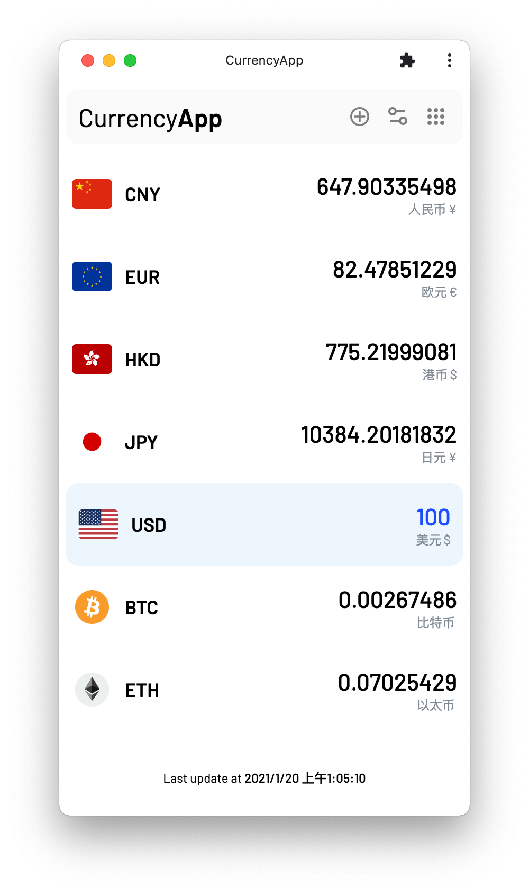
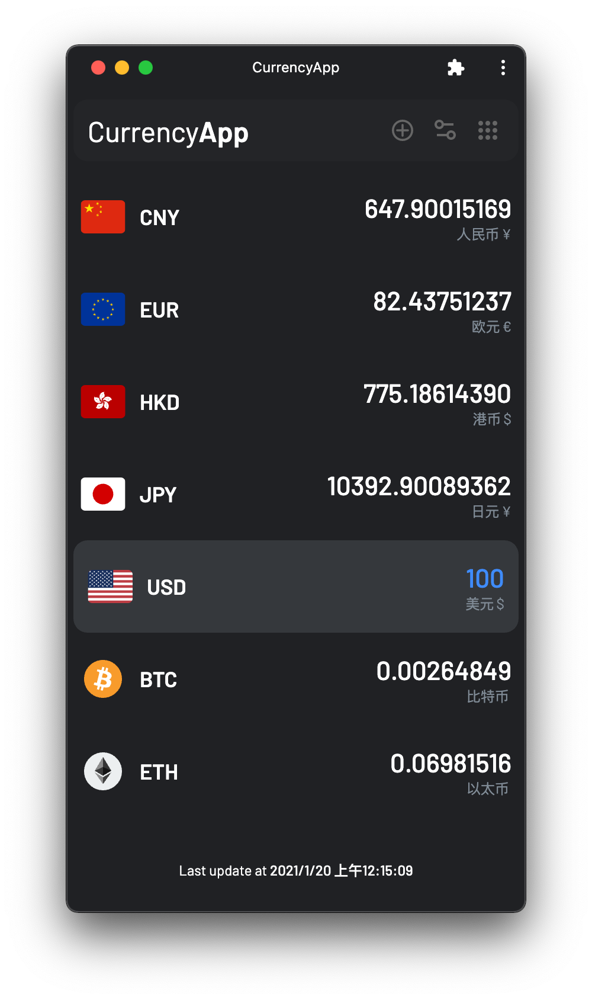

  

    
  

  <h2 align="center" style="font-weight: 600">CurrencyApp</h2>
  

    The Ultimate Currency Converter (PWA)
  

## Why I made this?

I use [xCurrency](https://xcurrency.com/) on my phone, but I don't want to leave my mouse and keyboard when I am using the computer, so I made this app.

Copy a lot of designs from [xCurrency](https://xcurrency.com/).

For the best experience, I suggest you install this app by clicking the circled plus button on the right side of the Chrome/Edge address bar.

## Features

- Support 150+ currencies and cryptos
- Dark mode support
- Convert to multiple currencies at the same time
- English / 简体中文
- Update currency rates every 60 seconds

## Screenshots

  

    
    &nbsp;&nbsp;&nbsp;&nbsp;
    
  

